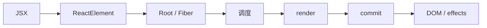
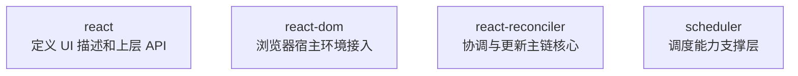

# React 19 源码怎么读：目录结构、包关系、调试方式与主线问题

这是我持续更新的一组 React 源码解读文章，也会尽量控制单篇篇幅，按主线一点点往里拆。  
这一篇先不急着扎进某个细节，而是从整体地图开始，先把 React 运行时主线和后面阅读源码时最重要的入口理顺。

## 前言

第一次看 React 源码时，我们最容易卡住的地方，往往不是某个函数太难，而是看着看着就失去了方向。

一开始，我们心里通常都有几个很具体的问题：想搞懂 Fiber，想知道 `setState` 之后到底发生了什么，也想弄明白 `useEffect` 为什么总像是“晚一步”执行。可真翻进仓库之后，这些问题又很快会被新的困惑打断：

- 这个目录到底是做什么的？
- 这段代码在整条链路里负责哪一段？
- 我们现在看到的，是 React 的核心逻辑，还是某个边缘实现？
- 为什么每个点都好像懂了一点，但就是连不成一条完整主线？

所以这篇文章不急着深挖某个具体实现，而是先做一件更基础、也更重要的事：

**先把 React 源码的阅读地图搭起来。**

这篇文章主要想回答四个问题：

- React 仓库里哪些地方值得先看
- `react`、`react-dom`、`react-reconciler`、`scheduler` 大概是怎么分工的
- 一次 React 更新的大主线到底是怎么流动的
- 刚开始读源码时，应该按什么方式推进，才不容易迷路

这里也先说明一下版本口径：这篇文章标题写的是 React 19，因为整体讨论的是 React 19 的主线机制；但在具体源码观察上，我会先以 React 19.1.1 作为基线来展开。

---

## 一、为什么很多人看 React 源码会越看越乱

React 源码难，不只是因为代码量大。

更准确地说，它难在：**层次很多，入口很多，主线很长，而且每一层都不是孤立存在的。**

我们表面上想搞懂的是一个问题，比如“`setState` 之后发生了什么”，但它背后往往会牵出一整串东西：

- 组件更新是怎么产生的
- update 是怎么入队的
- Fiber 节点怎么记录这次更新
- React 怎么决定这次更新什么时候执行
- render 阶段到底在算什么
- commit 阶段又是什么时候真正改 DOM 的

也就是说，React 源码不是那种“看一个函数就能闭环”的代码。它更像一套**分层协作的更新系统**。

如果一开始没有地图感，很容易进入一种状态：每看一段代码，都能理解一点；但每理解一点，又像是零散碎片。最后脑子里只剩下一堆词：

- Fiber
- Scheduler
- render
- commit
- lanes
- hooks

这些词我们都见过，但它们之间到底是什么关系，反而不清楚。

所以我更倾向于把 React 源码学习的第一步放在一个更基础的问题上：

> **React 到底是一套什么系统？**

把这个问题先看清楚，后面再去拆 Fiber、调度、Hooks、render、commit，才不容易一路走一路散。

---

## 二、先建立一张总图：React 到底是一套什么系统

如果先把 React 粗略抽象一下，我更愿意把它理解成这样一条主线：



> React 运行时总主线

这张图不细，但非常重要。因为它至少先帮我们看清了三件事。

### 1. JSX 不是 React 运行时真正处理的最终形态

我们平时写的是 JSX，但 React 运行时真正接收到的，并不是 `<App />` 这段看起来像模板的代码本身，而是编译之后的一种对象描述。

所以读源码时，第一层问题不应该是“React 怎么处理 `<App />`”，而应该是：

> **`<App />` 编译之后到底是什么对象？**

只要这一步没有先想清楚，后面再看 Root、Fiber、更新流程，就会总觉得前面少了一层。

### 2. `root.render(...)` 不是“立刻渲染 DOM”

很多人第一次接触 React 时，会下意识把 `root.render(<App />)` 理解成“把组件直接渲染到页面上”。

但从源码视角看，更准确的理解应该是：

> **它把一份描述 UI 的对象，送进 React 自己的更新系统。**

也就是说，这一步更像“发起一次更新”，而不是“立即完成渲染”。

### 3. React 的更新过程，本质上分成“计算”和“提交”两段

后面我们会经常看到两个词：**render** 和 **commit**。

可以先记住一句很关键的话：

- **render 阶段**：主要是在算，算这次更新之后“应该变成什么样”
- **commit 阶段**：主要是在交，真正把结果提交到宿主环境，比如浏览器 DOM

所以 React 不是“收到更新，立刻改 DOM”的直线模型。它更像这样：

> **描述 UI → 进入更新系统 → 被调度 → 计算结果 → 提交结果**

一旦先把这张总图建立起来，后面再去看 Fiber、Hooks、调度，就不会觉得这些东西是互相割裂的黑话。

---

## 三、先别急着翻细节：React 仓库里哪些地方值得先看

第一次打开 React 仓库时，很容易被目录吓到。但从“运行时源码阅读”的角度看，我们不需要一开始就把所有目录都研究一遍。

对这条“React 运行时主线”来说，真正值得优先关注的，主要有这几个方向。

### 1. `packages`：核心代码主战场

如果我们的目标是理解这些问题：

- JSX 产物是什么
- `createRoot` 做了什么
- Fiber 是什么
- 更新是怎么调度的
- render / commit 分别在做什么
- Hooks 为什么能工作

那么后面大部分时间，基本都会待在 `packages` 里。

因为真正和 React 运行时主线相关的核心逻辑，主要都在这里。

所以第一次看仓库时，不要想着“从根目录往下把所有东西都扫一遍”。更有效的做法，是先建立一个习惯：

> **以后提到 React 源码主线，默认先去 `packages` 里找。**

### 2. `fixtures`：最适合做最小实验场

学习源码很怕一上来就拿业务项目调试。业务代码一复杂，React 本身的调用链很容易被应用层噪音淹没。

这时候 `fixtures` 的价值就出来了。它更像一个实验场：当我们只想验证某一条很小的更新链路时，最小场景会比业务项目更适合观察。

### 3. `scripts`：工程支撑层

`scripts` 当然重要，但不是我们建立 React 主线认知的第一入口。

对第一阶段来说，知道它主要服务于构建、测试、打包、发布等工程流程，就够了。因为现在我们的目标不是“参与 React 仓库开发”，而是“先把 React 是怎么运行起来的搞清楚”。

### 4. 其他方向：先知道存在，不急着深挖

比如编译器、测试、工具链等方向，当然都重要。但如果我们的目标是先建立 React 运行时的整体认识，那么优先把这条主线打通，收益会更直接。

现阶段更好的策略是：

> **先把运行时主线搞清楚，再考虑编译器、RSC、性能优化等专题。**

---

## 四、核心包关系：`react`、`react-dom`、`react-reconciler`、`scheduler` 各自负责什么

看 React 源码时，如果只记目录，不记职责，很快还是会乱。真正有用的是把几个核心包的分工先记住。

我目前更倾向于用下面这种方式去理解它们：



> 核心包职责

下面逐个说。

### 1. `react`：定义“怎么描述 UI”

`react` 这一层，更像是 React 暴露给开发者的“上层接口”和“描述模型”。

我们平时写的这些东西：

- JSX
- 函数组件
- Hook
- `createContext`
- `memo`

最后都会落到 React 定义的一套模型里。

所以从源码学习角度看，`react` 回答的问题更像是：

> **开发者是如何把 UI 和状态意图，交给 React 的？**

如果继续顺着这条线往里看，很自然就会进入 JSX 编译产物和 ReactElement 这一层。

### 2. `react-dom`：浏览器环境的接入层

对前端开发者来说，最熟悉的入口通常是：

```js
import { createRoot } from 'react-dom/client'

const root = createRoot(container)
root.render(<App />)
```

这说明 `react-dom` 这一层解决的核心问题是：

> **React 怎么接到浏览器这个宿主环境上？**

也就是说，它更关心“把 React 应用挂到哪、怎么挂、最终怎么和 DOM 环境打交道”。

所以我们可以先把它理解成：

**浏览器场景下的宿主接入层。**

### 3. `react-reconciler`：真正的源码腹地

如果说：

- `react` 更偏“描述层”
- `react-dom` 更偏“宿主接入层”

那么 `react-reconciler` 才是后面真正要深挖的核心腹地。

因为我们最关心的这些东西，几乎都和它强相关：

- Fiber
- work loop
- beginWork
- completeWork
- render 阶段
- commit 阶段
- 更新如何传播
- 副作用如何收集和提交

可以先记一句非常实用的话：

> **React 真正“怎么处理一次更新”，大头都在 `react-reconciler` 这层。**

如果继续往更新主链内部走，很多关键问题最终都会落到这一层。

### 4. `scheduler`：不是主角，但非常关键

这里不必一开始就把 `scheduler` 的细节掰得很深，但它在整套系统里的位置，我们最好先有一个整体认识。

React 之所以不再只是“同步调用 → 直接算完 → 直接提交”，背后离不开调度能力。这部分我们可以暂时理解成：

- 什么时候做
- 哪个先做
- 哪个可以稍后做
- 当前要不要让出执行机会

这些能力，不是随便塞在某个业务函数里就能完成的，所以 React 需要一层相对独立的调度支撑。

现阶段先记住一句就够了：

> **`scheduler` 提供的是调度能力支撑，不等于 React 全部逻辑本身，但它对 React 的更新模型非常关键。**

---

## 五、一次 React 更新的大主线：从 JSX 到 DOM 提交

前面把目录和核心包大致摆清楚之后，接下来最重要的一步，就是把 React 的“主线流程”先跑通。

因为无论是看 `createRoot`、看 Fiber、看 Hooks，还是看 `beginWork`、`commit`，本质上都还是在拆这一条主线。

我先把它再压缩成一张图：

```text
JSX
  ↓ 编译
ReactElement
  ↓ root.render / 触发更新
Root / Fiber Root / HostRoot Fiber
  ↓ 调度
render 阶段
  ↓ 生成本次提交所需的信息
commit 阶段
  ↓
DOM 更新 / layout effect / passive effect
```

这一条线里，最容易搞混的是两件事：

第一，**React 运行时真正处理的不是 JSX 本身，而是 JSX 编译后的 ReactElement**。

第二，**React 并不是一收到更新就直接改 DOM，而是先经过调度、render 计算，再进入 commit 提交**。

所以从源码阅读角度看，后面我们遇到的大部分概念，都能挂到这条链上。

### 1. JSX 先变成 ReactElement

我们平时写的是：

```jsx
<App count={1} />
```

但 React 真正接收到的，不是这段“长得像 HTML 的语法”，而是编译产物。

所以阅读源码的第一层问题，不应该是“React 怎么处理 `<App />`”，而应该是：

> **`<App />` 编译之后到底是什么对象？**

### 2. `root.render(element)` 把更新送进系统

对很多开发者来说，`root.render(<App />)` 最容易产生一个错觉：好像这行代码一执行，页面就立刻被渲染出来了。

但源码视角下，更准确的理解应该是：

> **`root.render` 负责把一份 element 更新送进 React 的根节点更新体系。**

也就是说，这一步更像“发起一次更新”，而不是“直接完成渲染”。

### 3. Root / Fiber 系统接管这次更新

一旦更新进入系统，它就不再只是一个普通对象了。React 会把它放进 Root/Fiber 这套结构里，让后续调度、计算、提交都有地方可挂。

所以后面当我们看到这些词时，不要把它们看成独立概念：

- Root
- FiberRoot
- HostRoot Fiber
- update queue

它们其实都属于 React 这套更新系统的基础设施。

### 4. 调度决定“现在做不做、先做哪部分”

React 不是简单地“收到更新 → 马上全做完”。它还要决定：

- 这次更新优先级高不高
- 要不要马上做
- 能不能让一部分工作稍后做
- 当前阶段能不能让出执行机会

这时候调度层就进来了。

所以后面我们看到 lanes、调度入口、任务安排的时候，本质上是在看 React 如何安排“这次更新该怎么被执行”。

### 5. render 阶段负责计算结果，不直接提交

render 阶段是很多人第一次读源码时最容易误解的部分。因为“render”这个词太像“渲染到页面”。

但从源码视角看，render 阶段更准确的理解应该是：

> **它在算下一次要提交什么，而不是立即把结果改到页面上。**

这一阶段里，React 会基于当前树和本次更新，逐步构造工作中的新树，并收集这次提交所需的信息。

所以后面我们看到：

- `beginWork`
- `completeWork`
- work loop
- flags / subtreeFlags

本质上都是 render 阶段里的核心组成。

### 6. commit 阶段才真正提交结果

当 render 阶段把“这次更新要做什么”算得差不多了，React 才会进入 commit 阶段。

到了这一阶段，才会真正发生这些事：

- 插入、更新、删除 DOM
- 执行 layout 相关副作用
- 在后续时机执行 passive effect

所以 React 整体并不是一段线性同步逻辑，而更像一条清晰的更新流水线：

> **描述 UI → 发起更新 → 调度 → render 计算 → commit 提交**

---

## 六、React 源码应该怎么读：按问题读，不按文件读

知道主线之后，接下来的问题就变成：

> 那源码到底该怎么读？

我自己的建议是：**按问题读，不要按文件读。**

也就是说，不要一上来就给自己定任务：“今天我要看完某个文件。”更好的方式，是先定一个问题，再去找这个问题对应的入口和调用链。

### 1. 先问问题，再找入口

比如我们可以先问自己这些问题：

- JSX 编译后到底是什么
- `createRoot(container)` 到底创建了什么
- `root.render(<App />)` 做了什么
- `setState` 之后发生了什么
- DOM 是在 render 阶段更新，还是在 commit 阶段更新
- Hooks 为什么必须按顺序调用

这样做的好处是，源码不再是一整片森林，而是变成了几条有明确方向的小路。

### 2. 每次只追一条最小闭环

很多人读源码会越看越累，还有一个原因：一开始就拿复杂场景下手。

更好的方法，是先拿一个最小例子：

```jsx
const root = createRoot(container)
root.render(<App />)
```

或者：

```jsx
function App() {
  const [count, setCount] = useState(0)
  return <button onClick={() => setCount(c => c + 1)}>{count}</button>
}
```

我们只追一条最短链路：

- 这个 element 怎么进入系统
- 这次更新怎么入队
- 什么时候开始 render
- 什么时候 commit
- effect 什么时候执行

只要最小闭环走通一次，后面再看复杂场景，心里就会稳很多。

### 3. 先看入口函数，再看核心数据结构

源码阅读里有一个很实用的原则：

> **入口函数负责告诉我们“从哪里开始追”，数据结构负责告诉我们“数据是怎么流动的”。**

比如：

- 当问题落在 JSX 编译产物时，重点通常是 ReactElement 这个对象本身
- 当问题落在应用启动时，重点通常是 Root / HostRoot Fiber 这层结构
- 当问题落在更新如何进入系统时，重点通常是 Update、UpdateQueue、Lane
- 当问题落在 render 过程时，重点通常是 Fiber、flags、workInProgress
- 当问题落在 Hooks 内部机制时，重点通常是 Hook 链表以及它和 Fiber 的关系

### 4. 阅读源码时，最好始终问一句：它在主线里负责什么

无论我们现在看到的是：

- 一个目录
- 一个包
- 一个函数
- 一个字段
- 一个变量名

都先问一句：

> **它在整条更新主线里，负责哪一段？**

只要这个问题一直留在脑子里，源码阅读就不容易发散。

---

## 七、调试方式怎么选：从只读到可断点

这部分我不打算写成环境搭建教程，因为对刚开始阅读源码的人来说，更重要的还是先建立地图，再逐步进入调试。我更倾向于把调试方式分成三个层次。

### 1. 第一层：先只读，不着急跑全链路

刚开始时，不一定要马上把 React 仓库完整跑起来，也不一定要急着深挖每个入口。

这个阶段更重要的是：

- 建立总图
- 记住核心包职责
- 知道接下来继续往里看时，核心问题会落在哪些位置
- 对“从 JSX 到 commit”的主线有整体印象

### 2. 第二层：用最小 demo 打断点追入口

当我们开始进入具体主题，比如：

- JSX 到 ReactElement
- `createRoot`
- `root.render`
- `setState`
- `useEffect`

这时候最好的方式，就是准备一个最小 demo，然后围绕一个非常具体的问题去断点。

不要想着“今天调试 React”，而要想着：

- 今天只看 `createRoot` 做了什么
- 今天只看一次 `setState` 怎么入队
- 今天只看 `useEffect` 在什么时候被记录、什么时候被执行

问题越单一，断点越清晰，收获越大。

### 3. 第三层：围绕一条具体链路深挖到底

真正进入深入阶段时，我们的目标也不该是“把 React 全部调完”。更现实也更有效的目标是：

- 把一次更新从触发到提交完整走通
- 把一个 Hook 从调用到记录到执行完整走通
- 把 Root、HostRoot Fiber、update queue 的关系彻底理顺

换句话说，调试不是为了证明“我能跑源码”，而是为了回答一个具体问题。

---

## 八、顺着这张地图继续往里看，我们会遇到哪些核心问题

到这里，这篇“阅读地图”其实就差不多搭完了。

如果继续顺着同一条主线往里看，接下来最核心的问题，大致会落在这些位置：

### 1. JSX 到 ReactElement

> JSX 编译后到底是什么？React 运行时最先拿到的对象长什么样？

### 2. `createRoot` 与 `root.render`

> React 应用启动时，到底创建了什么？Root 和 HostRoot Fiber 是什么关系？

### 3. Fiber 到底是什么

> Fiber 为什么不是 ReactElement，也不是 DOM？React 为什么需要 Fiber？

### 4. 从 `setState` 到调度

> 一次更新是怎么进入系统的？Update、UpdateQueue、Lane 分别扮演什么角色？

### 5. render 阶段

> `beginWork` 和 `completeWork` 在做什么？render 阶段为什么不直接改 DOM？

### 6. commit 阶段

> DOM 到底什么时候更新？layout effect 和 passive effect 分别在什么时机执行？

### 7. Hooks 内部原理

> Hooks 为什么必须按顺序调用？`useState` 和 `useEffect` 是如何挂到 Fiber 上的？

把这些问题串起来之后，React 源码在我们脑子里就不再是一堆零散名词，而会慢慢变成一条完整的更新链路。

---

## 结语

React 源码最难的地方，从来都不是某一个函数本身。

真正难的是：如果没有地图，很多细节都会看起来彼此割裂。今天看到 Fiber，明天看到 Hook，后天又看到 commit，名词越来越多，但主线反而越来越模糊。

所以在真正扎进细节之前，先把 React 当成一套系统看清楚，会让后面的阅读顺很多。

当我们先知道：

- React 整体是一条怎样的更新主线
- 仓库里哪些地方和这条主线直接相关
- 四个核心包分别负责什么
- 继续往里读时，核心问题大概会落在哪些位置

那接下来再看 ReactElement、Root、Fiber、调度、render、commit、Hooks，很多原本抽象的词，才会慢慢落地。

如果这篇“阅读地图”已经搭起来了，那么下一步最自然的切口，就是回到主线最前面，先看一个问题：

**React 真正接收到的第一个核心对象，到底长什么样？**

如果这篇对你有帮助，欢迎点个赞支持。后面我也会继续把这组 React 源码文章慢慢补完整。

这组源码解读文章也会同步整理到 GitHub 仓库里，方便集中查看和持续更新：

GitHub: https://github.com/HWYD/source-reading-notes

如果觉得这组内容对你有帮助，也欢迎顺手点个 Star。

## 最近在做的一个 AI 项目

最近我也在持续迭代一个 AI 项目：**AI Mind**。  
如果你对 AI 应用工程化、Tool Calling、Skill Runtime、MCP 这些方向感兴趣，欢迎来看看。

GitHub: https://github.com/HWYD/ai-mind

如果觉得项目还不错，也欢迎顺手点个 Star。