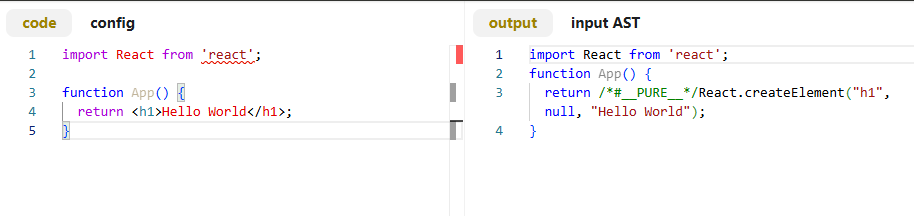
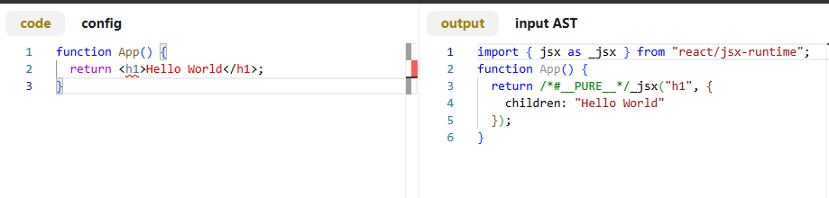
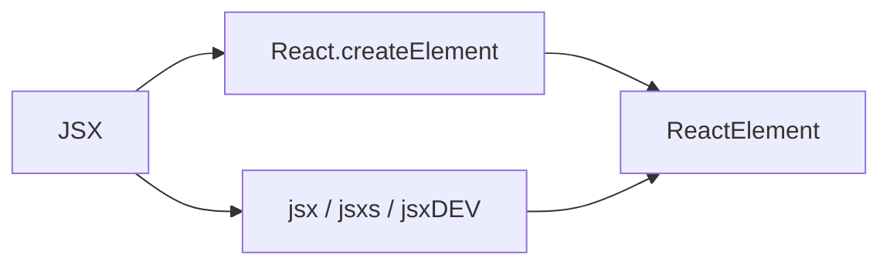
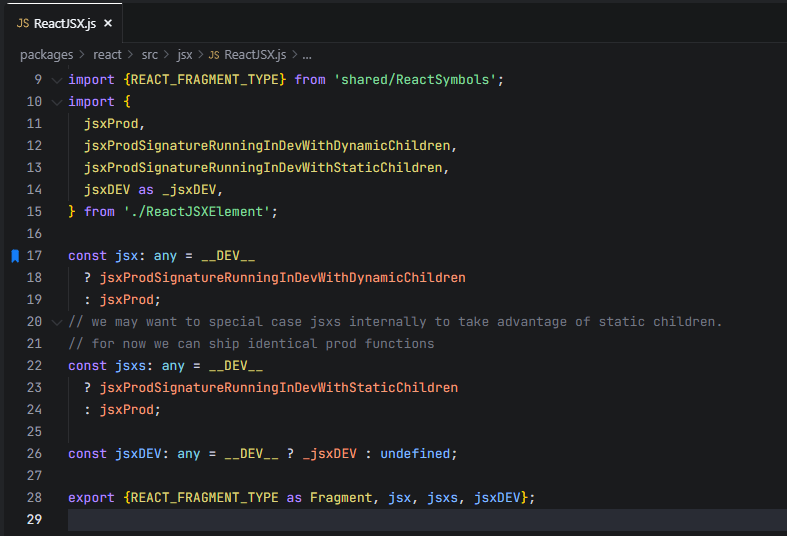
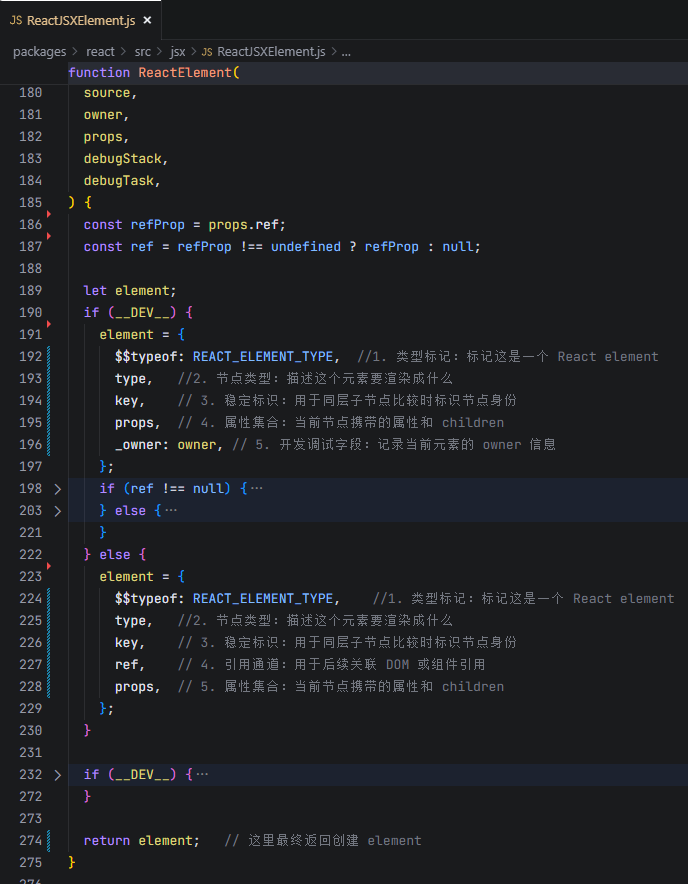
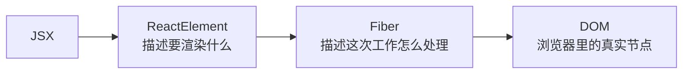
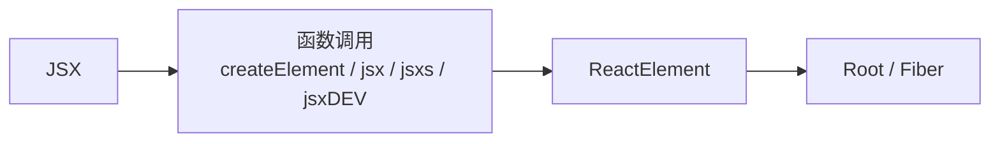

# React 19 源码怎么读：JSX 编译后本质上产出的是什么对象？

这是我持续更新的一组 React 源码解读文章，也会尽量控制单篇篇幅，按主线一点点往里拆。  
这一篇先不急着往 Root 和 Fiber 里走，而是先把 React 主线最前面那一段补上：JSX 编译之后，React 真正接收到的到底是什么。

## 前言

上一篇里，我先把 React 源码的整体地图搭了起来，大致理清了这样一条主线：

**JSX → ReactElement → Root / Fiber → 调度 → render → commit → DOM / effects**

但如果这条主线最前面那一段没有补清楚，后面很多概念其实都容易悬空。

比如继续往下看时，很快就会遇到这些问题：

- `createRoot` 接到的到底是什么
- `root.render(<App />)` 送进系统的到底是什么
- Fiber 是不是 JSX 直接变出来的
- ReactElement、Fiber、DOM 这几个对象，到底分别处在主线的哪一层

这些问题继续往下追，最后都会回到一个更基础的问题上：

> **JSX 编译后，本质上产出的到底是什么对象？**

所以这一篇不急着进入 Root，也不急着进入 Fiber，而是先把 React 主线最前面的这一段补清楚。

这篇文章主要想回答几个问题：

- JSX 为什么只是语法糖，而不是模板引擎
- JSX 编译后到底会变成什么
- `React.createElement` 和 `jsx / jsxs / jsxDEV` 是什么关系
- React 真正接收到的第一个核心对象是不是 ReactElement
- ReactElement 和 Fiber、DOM、实例之间到底有什么区别

这里也先说明一下版本口径：这篇文章标题写的是 React 19，因为整体讨论的是 React 19 的主线机制；但在具体源码观察上，我会先以 React 19.1.1 作为基线来展开。

---

## 一、先说结论：React 真正接收到的第一个核心对象是 ReactElement

先把这篇最核心的结论放在前面：

> **如果把 React 主线往前推一层，JSX 之后真正进入 React 运行时的，不是模板，不是 DOM，也不是 Fiber，而是 ReactElement。**

这句话很重要。

因为我们平时写 React 代码时，表面上写的是这种东西：

```jsx
<App count={1} />
```

但 React 运行时并不会直接拿着这段 JSX 语法往下跑。  
在真正进入运行时之前，JSX 会先被编译成函数调用代码，然后在运行时阶段创建出一个描述当前节点的对象。

这个对象，就是 **ReactElement**。

换句话说，React 主线最前面那一段，如果展开来看，更准确的样子应该是这样：


也就是说，JSX 不是 React 运行时直接处理的对象；React 真正拿到的第一层核心输入，是 **ReactElement**。

这一步如果没有先立住，后面看 `createRoot`、看 Fiber、看更新队列时，就很容易把“描述对象”“工作节点”“真实 DOM”混在一起。

---

## 二、JSX 是语法糖，不是模板引擎

在继续往下看之前，我想先纠正一个很容易混淆的认知：

> **JSX 是语法糖，不是模板引擎。**

这个点看起来很基础，但实际上很关键。

因为很多人第一次接触 JSX 时，会天然把它理解成一种“模板写法”。毕竟它长得很像 HTML：

```jsx
<div className="box">{count}</div>
```

但从语言层面看，JSX 并不是 React 发明的一套模板字符串规则，它更像是 JavaScript / TypeScript 里的一个**语法扩展**。

这意味着：

- 条件判断来自 JavaScript
- 循环来自 JavaScript
- 变量作用域来自 JavaScript
- 表达式求值也来自 JavaScript

比如：

```jsx
{isLogin ? <UserCard /> : <LoginButton />}
```

这里的条件逻辑不是 React 自己定义的模板指令，而是标准的 JavaScript 三元表达式。

再比如：

```jsx
{list.map(item => <li key={item.id}>{item.name}</li>)}
```

这里的循环也不是模板引擎里的专用语法，而是 JavaScript 的 `map` 调用。

所以从源码视角看，JSX 更准确的理解不是：

> “React 运行时直接处理的一种模板语言”

而是：

> “一种更方便描述 UI 的语法形式，它在进入运行时之前会先被编译改写”

也正因为如此，后面真正要追的，不是“React 怎么处理 JSX 文本”，而是：

> **JSX 编译之后，到底变成了什么调用；这些调用在运行时又创建了什么对象。**

---

## 三、JSX 编译后会变成什么

既然 JSX 不是最终形态，那接下来的问题就是：

> **JSX 编译后到底会变成什么？**

如果只说最核心的一句，那就是：

> **JSX 会被编译成函数调用代码。**

如果先用一句最白话的话概括，这两类写法的区别可以先粗略理解成：

- classic runtime 更常见的编译产物是 `React.createElement(...)`
- automatic runtime 更常见的编译产物是 `jsx / jsxs / jsxDEV(...)`

先把这个区别抓住，后面再看运行时入口和 ReactElement，就不会太乱。

### 1. classic runtime（旧 JSX 转换方式）

在 classic runtime 下，JSX 通常会被改写成对 `React.createElement(...)` 的调用。

先看输入的 JSX：

```jsx
import React from 'react';

function App() {
  return <h1>Hello World</h1>;
}
```

编译后更常见的目标大致会变成：

```js
import React from 'react';

function App() {
  return React.createElement("h1", null, "Hello World");
}
```

如果直接看一眼 Babel 的编译结果，会更直观一些：



这里最重要的，不是去背参数顺序，而是先抓住一个事实：**classic runtime 下，JSX 最终会被改写成 `React.createElement(...)` 这样的调用。**

### 2. automatic runtime（新 JSX 转换方式）

在 automatic runtime 下，JSX 编译后更常见的目标是：

- `jsx(...)`
- `jsxs(...)`
- `jsxDEV(...)`

比如一段最简单的 JSX：

```jsx
function App() {
  return <h1>Hello World</h1>;
}
```

编译后更常见的结果，会变成类似这样的运行时代码：

```js
import { jsx as _jsx } from "react/jsx-runtime";

function App() {
  return _jsx("h1", {
    children: "Hello World"
  });
}
```

如果直接看一眼 Babel 的编译结果，会更直观一些：



这里最重要的，不是去背 `_jsx` 这个名字本身，而是先抓住一个更稳定的事实：

> **JSX 不会原样进入 React 运行时，而是会先被改写成运行时函数调用。**

而这些运行时入口，后面最终都会走向 ReactElement 的创建。

---

## 四、`React.createElement` 和 `jsx / jsxs / jsxDEV` 到底是什么关系

看到这里时，脑子里往往会冒出一个新的问题：

- 一边是 `React.createElement`
- 一边是 `jsx / jsxs / jsxDEV`

它们到底是什么关系？

如果先说结论，可以把它们理解成这样：

> **它们都是 JSX 编译后的运行时入口，只是编译目标和使用场景不完全一样；但共同目标，都是创建 ReactElement。**

也就是说，变化主要发生在：

- JSX 默认会被编译到哪里
- 开发环境和生产环境会走哪些不同入口
- automatic runtime 和 classic runtime 在运行时入口选择上有什么区别

但不变的核心是：

> **React 仍然需要把“这段 JSX 描述的节点”变成一个 React 运行时可以处理的对象。**

而这个对象，就是 ReactElement。

如果把它们的关系再压缩一点，大致可以看成：



也就是说：

- `React.createElement` 可以创建 ReactElement
- `jsx / jsxs / jsxDEV` 也会创建 ReactElement

它们不是在创造不同终点，而是在走向同一个终点的不同入口。

这一点很重要。  
因为如果注意力全放在“它们名字为什么不一样”，就很容易忽略真正该抓住的东西：

> **无论编译目标是什么，React 运行时最先稳定拿到的核心对象，仍然是 ReactElement。**

---

## 五、`jsx / jsxs / jsxDEV` 是干什么的

automatic runtime 里常见的 `jsx(...)`、`jsxs(...)`、`jsxDEV(...)`，本质上都是 JSX 编译后的运行时入口。

也就是说，编译器不会把 JSX 原样丢给 React，而是会把它改写成对这些函数的调用，再由这些函数去创建对应的 ReactElement。

这一层先抓住两件事就够了：

### 1. 它们都是运行时入口

它们不是编译阶段的“结果字符串”，而是编译后代码在运行时真正会去调用的函数。

### 2. 它们最终都服务于 ReactElement 的创建

虽然不同场景下可能走不同入口，但对 React 主线来说，更重要的不是入口名字，而是：

> **这些入口最终都在帮 React 把 JSX 描述转成 ReactElement。**

如果把这一层再压成一句话，大致就是：

> JSX 是写法，`jsx / jsxs / jsxDEV` 是运行时入口，ReactElement 是运行时真正产出的核心对象。

---

## 六、真正生成 ReactElement 的核心逻辑在哪里

到这里，问题就可以再往前推一步：

> **既然这些运行时入口最终都要创建 ReactElement，那真正生成 ReactElement 的核心逻辑在哪里？**

如果顺着 automatic runtime 这条线继续往里看，通常会先落到 `ReactJSX.js` 这一层。  
这一层会把 `jsx`、`jsxs`、`jsxDEV` 这些运行时入口组织起来，再继续把调用往下送。



从这一步再往下追，真正创建 ReactElement 的核心逻辑会继续收拢到 `ReactJSXElement.js` 里。

换句话说，这里可以先把源码里的分层粗略理解成两步：

- `ReactJSX.js` 更像运行时入口层
- `ReactJSXElement.js` 更像 ReactElement 的核心创建层

到这里，主线其实已经接住了。  
因为这一节真正要解决的，不是把所有 dev-only 分支都摊开，而是先把“运行时入口在哪里、ReactElement 创建逻辑收在哪里”这条线理顺。

---

## 七、ReactElement 的核心字段有哪些

既然这一篇的核心结论是“React 真正接收到的第一个核心对象是 ReactElement”，那至少还要回答一个问题：

> **这个对象长什么样？**

如果只抓最核心的字段，可以先看这几个：

- `$$typeof`
- `type`
- `key`
- `ref`
- `props`

这一层最重要的，不是把字段背成字典，而是先知道：

> **ReactElement 本质上是一个描述当前节点信息的对象。**

下面这张图里，可以直接看到 `ReactElement(...)` 最终返回对象的大致结构。  
同时也能顺手看到一个细节：**开发环境和生产环境下，ReactElement 的内部结构并不完全一样。** 开发环境会保留更多调试相关信息，而生产环境会尽量保持更精简。



先从图里最值得注意的几个字段看起。

### 1. `$$typeof`

`$$typeof` 最核心的作用，是标记这是不是一个 React element。  
也就是说，这不是一个普通对象，而是 React 自己能够识别的一类特殊对象。

### 2. `type`

`type` 描述当前节点是什么类型。  
它可能是原生标签，比如 `'div'`，也可能是函数组件、类组件，或者其他 React 可识别类型。

所以这一项更像是在回答：

> “这个元素最终想表达的是什么节点？”

### 3. `key`

`key` 的核心作用，是在同层子节点比较时标识节点身份。  
它不是一个“全局唯一 id”，而是 React 在后面处理同层节点更新时，用来帮助定位和复用节点的重要标识。

### 4. `ref`

在生产环境这条分支里，可以看到 `ref` 也会进入最终对象。  
这里更适合把它理解成一种**引用信息 / 引用通道**：React 后续会基于它去处理和 DOM 或组件引用相关的逻辑。

### 5. `props`

`props` 就是当前节点携带的数据集合。  
包括我们平时传入的属性，也包括 children。

所以如果先从最粗的角度看，ReactElement 至少已经能描述这些问题：

- 这是什么节点
- 节点上带了什么数据
- 有没有 `key`
- 有没有 `ref`

如果看开发环境这条分支，还能注意到 `_owner` 这样的字段。  
它更偏**开发调试信息**，用来记录当前元素的 owner 信息，不属于这一篇最需要先抓住的通用核心字段。

所以到这里，可以先把 ReactElement 粗略理解成：

> **一个用来描述“要渲染什么”的对象。**

---

## 八、为什么 ReactElement 不是 Fiber、不是 DOM、不是实例

到这里，ReactElement 这一层的对象结构就更具体了。  
但如果 ReactElement、Fiber、DOM、实例这几层没有分开，后面主线还是会继续糊。

很多时候，问题不一定出在某个函数没看懂，而是下面这些东西还没有真正分开：

- ReactElement
- Fiber
- DOM
- 实例

### 1. ReactElement：描述对象

ReactElement 更像是在回答：

> “我想渲染一个什么东西？”

它描述的是：

- 类型
- props
- key
- ref

也就是说，它更偏“描述层”。

### 2. Fiber：工作节点

Fiber 不一样。  
Fiber 不是 JSX 直接产物，也不是 ReactElement 本身。它更像 React 运行时里的**工作节点**。

它要负责的事情更多，比如：

- 记录当前节点在工作树里的位置
- 记录更新相关信息
- 记录副作用
- 作为 render / commit 过程中被处理的工作单元

所以它更像是在回答：

> “这次工作，该怎么被处理？”

### 3. DOM：宿主节点

DOM 则是浏览器里的真实节点。  
它属于宿主环境层，不属于 React 在描述对象或工作节点这一层的概念。

也就是说：

- ReactElement 不是 DOM
- Fiber 也不是 DOM
- DOM 是 commit 阶段之后真正落到浏览器里的那一层东西

所以如果把这几层放在一起看，大致可以画成这样：



这张图虽然很粗，但非常有用。

因为它至少先把三个最容易混淆的概念分开了：

- **ReactElement**：描述对象
- **Fiber**：工作节点
- **DOM**：宿主节点

所以到这里，这篇最该带走的一句认知，其实是：

> **ReactElement 更像描述对象，Fiber 更像工作节点，它们不是一回事。**

---

## 九、把这一步接回 React 主线

到这里，React 主线最前面那一段就真正接上了。

如果把它重新压回总图里，大概就是：

**JSX → 函数调用 → ReactElement → Root / Fiber**

再展开一点，也就是：

- JSX 不会直接进入 Root / Fiber 系统
- JSX 会先被编译成函数调用代码
- 这些运行时入口最终会创建 ReactElement
- React 真正稳定接收到的第一层核心对象，是 ReactElement

如果把这一步再压缩成一张图，大概就是：



到这里，React 主线最前面那一段就不再是空着的了。

而把这一步补清楚之后，下一步再去看 `createRoot` 和 `root.render`，很多东西就不会悬空了。  
因为那时候再往下追，就不是在问“React 到底接到了什么”，而是在问：

> **React 拿到 ReactElement 之后，是怎么把它送进 Root 和更新系统里的？**

这也正好是下一篇最自然的切口。

---

## 结语

React 源码最难的地方，从来都不是某一个函数本身。

真正难的是：如果没有地图，很多细节都会看起来彼此割裂。今天看到 JSX transform，明天看到 ReactElement，后天又看到 Fiber，名词越来越多，但主线反而越来越模糊。

所以这一篇真正补上的，不是某个零散知识点，而是 React 主线最前面的输入层：

> **JSX 并不会直接进入 React 运行时主线，React 真正接收到的第一个核心对象，是 ReactElement。**

把这一步看清楚之后，后面再去看 `createRoot`、`root.render`、HostRoot Fiber、update queue，这些东西的落点都会更稳。

如果这篇对你有帮助，欢迎点个赞支持。后面我也会继续把这组 React 源码文章慢慢补完整。

这组源码解读文章也会同步整理到 GitHub 仓库里，方便集中查看和持续更新：

GitHub：https://github.com/HWYD/source-reading-notes

如果觉得这组内容对你有帮助，也欢迎顺手点个 Star。

## 最近在做的一个 AI 项目

最近我也在持续迭代一个 AI 项目：**AI Mind**。  
如果你对 AI 应用工程化方向感兴趣，欢迎来看看：

GitHub：https://github.com/HWYD/ai-mind

如果觉得还不错，也欢迎顺手点个 Star。
