# React 19 源码怎么读：createRoot 和 root.render 到底做了什么？

这是我持续更新的一组 React 源码解读文章，也会尽量控制单篇篇幅，按主线一点点往里拆。  
这一篇先不急着往 Fiber 内部结构和 render 细节里走，而是先把 React 主线里的“系统入口”这一段补上。

## 前言

上一篇里，我已经把 React 主线最前面那一段补了出来：

**JSX → ReactElement**

也就是说，React 运行时真正接收到的第一层核心对象，不是 JSX 语法本身，而是 ReactElement。

但如果只停在这里，后面很多问题其实还是悬着的。

比如：

- React 拿到 ReactElement 之后，下一步先去哪了？
- `createRoot(container)` 到底创建了什么？
- `root.render(element)` 到底是在“渲染”，还是在“发起一次更新”？
- ReactElement 是在这里立刻变成 Fiber 了吗？

这些问题继续往下追，主线就会自然推进到 React 的系统入口层。

所以这一篇不急着进入 Fiber 内部结构，也不急着进入 render / commit，而是先把这一段补清楚：

> **ReactElement 是怎么进入根级更新系统的？**

这篇文章主要想回答几个问题：

- `createRoot(container)` 返回的 root 到底是什么
- `createRoot` 初始化了哪些关键对象
- `ReactDOMRoot`、`FiberRoot`、`HostRoot Fiber` 分别是什么关系
- `root.render(element)` 到底做了什么
- ReactElement 在这里是怎么进入根级更新系统的

这里也先说明一下版本口径：这篇文章标题写的是 React 19，因为整体讨论的是 React 19 的主线机制；但在具体源码观察上，我会先以 React 19.1.1 作为基线来展开。

---

## 一、先说结论：`createRoot` 负责初始化根容器，`root.render` 负责发起一次根更新

先把这一篇最核心的结论放在前面：

1. `createRoot(container)` 不是立刻把组件渲染到页面  
2. 它更像是在初始化一个 React 根容器  
3. 真正把 ReactElement 送进系统的是 `root.render(element)`，而这一步本质上是在发起一次根更新  

平时写 React 时，我们很容易把这两步看成一整句：

```jsx
const root = createRoot(container)
root.render(<App />)
```

表面上看，这像是一段连续的“开始渲染”代码。  
但如果从源码视角往里看，会发现这两步分工非常明确：

- `createRoot(container)` 负责把根容器搭起来
- `root.render(element)` 负责把新的 UI 描述送进根级更新系统

换句话说，这一篇真正想补上的，不是“页面怎么显示出来”，而是：

> **React 在真正开始 render 之前，入口层到底先做了什么。**

这里我先提前立住一句全篇最重要的边界话：

> **到这里为止，ReactElement 先进入的是根级更新系统，还没有真正展开成后面 render 阶段里的 Fiber 子树。**

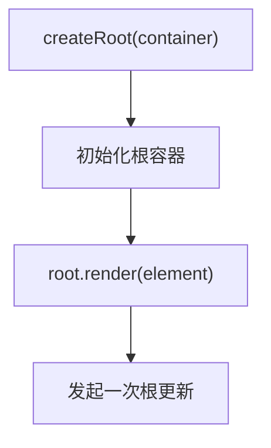

---

## 二、`createRoot(container)` 返回的 root 到底是什么

继续往下看时，一个很自然的问题就是：

> `createRoot(container)` 返回的这个 root，到底是什么？

如果只看业务代码，我们拿到的是这样一个对象：

```js
const root = createRoot(container)
```

但这里的 `root`，并不是 React 内部真正维护的 `FiberRoot`。  
更准确地说，它是一个对外暴露的 API 层 root 句柄，也就是 **`ReactDOMRoot`**。

这一层先分清很重要，因为它能帮我们把两种 root 区分开。

### 1. 业务代码拿到的 root

这是 `ReactDOMRoot`。  
它更像 React DOM 暴露给外部使用的句柄，后面调用 `root.render(...)`、`root.unmount()` 也是通过它发起的。

### 2. React 内部真正维护的 root

这一层才是后面真正贯穿运行时系统的根对象，也就是 `FiberRoot`。

两者之间的连接方式并不复杂：

- `ReactDOMRoot` 对外暴露方法
- 它内部通过 `_internalRoot` 持有真正的 `FiberRoot`

所以从这里开始，我们最好先把两件事分开：

- **我们手里拿着的 root**
- **React 内部真正维护的 root**

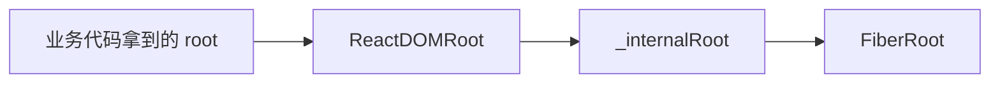

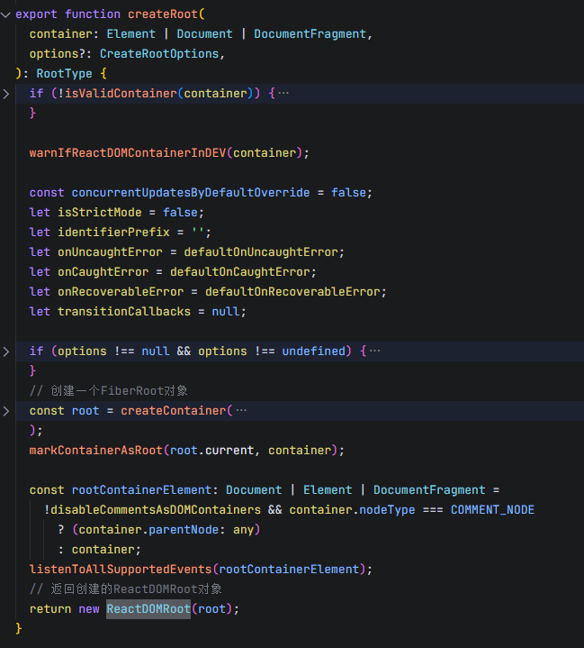

上面这张源码图里，最值得注意的是最后两步：

- 先通过 `createContainer(...)` 拿到内部的 `root`
- 最后返回 `new ReactDOMRoot(root)`

这也就把这一节最关键的判断立住了：**`createRoot(container)` 返回的不是 FiberRoot 本身，而是一个对外暴露的 `ReactDOMRoot` 句柄。**

---

## 三、`createRoot` 到底初始化了什么

既然 `createRoot(container)` 返回的是一个对外句柄，那它内部到底做了什么？

如果顺着源码往下看，会发现 `createRoot` 真正做的事情，不是“立刻开始渲染”，而是先把根级运行时入口搭起来。

这一层更适合按系统分层来理解，而不是按源码步骤一项项罗列。

### 1. 对外先创建了一个 root 句柄

最外层拿到的是 `ReactDOMRoot`。  
这一层的作用很直接：业务代码后续通过它来调用 `render(...)`、`unmount(...)` 这些入口方法。

也就是说，React 先对外准备了一个“可用的 root 句柄”。

### 2. 内部真正建起了根级状态容器

再往里走，会进入 `createContainer(...)`。  
从这里开始，才真正进入 reconciler 内部的 root 初始化流程。

这一层真正创建出来的是 **FiberRoot**。

FiberRoot 可以先粗略理解成：

> **整棵 React 树外侧的根级状态容器。**

后面很多根级信息，都会挂在这一层上，比如：

- 当前根对应的 container
- 当前这棵树的 `current`
- pending lanes
- 其他根级调度与状态信息

### 3. 同时把 Fiber 树入口和更新系统准备好了

Root 初始化并不会只停在 FiberRoot 这一层。  
在创建 FiberRoot 的同时，还会继续创建 **HostRoot Fiber**。

HostRoot Fiber 是整棵 Fiber 树最顶层的根 Fiber。  
后面真正进入 render 阶段时，工作会从这里开始往下展开。

除此之外，根初始化时还会顺手把一些关键状态准备好，比如：

- 根 Fiber 的 `memoizedState`
- 根 Fiber 的 `updateQueue`

这也意味着：

> **Root 从来不是一个空壳。**  
> **它在一开始，就已经把根级状态容器、Fiber 树入口和后续更新通道一起准备好了。**

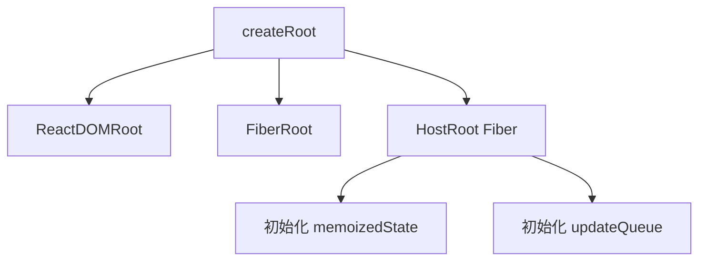

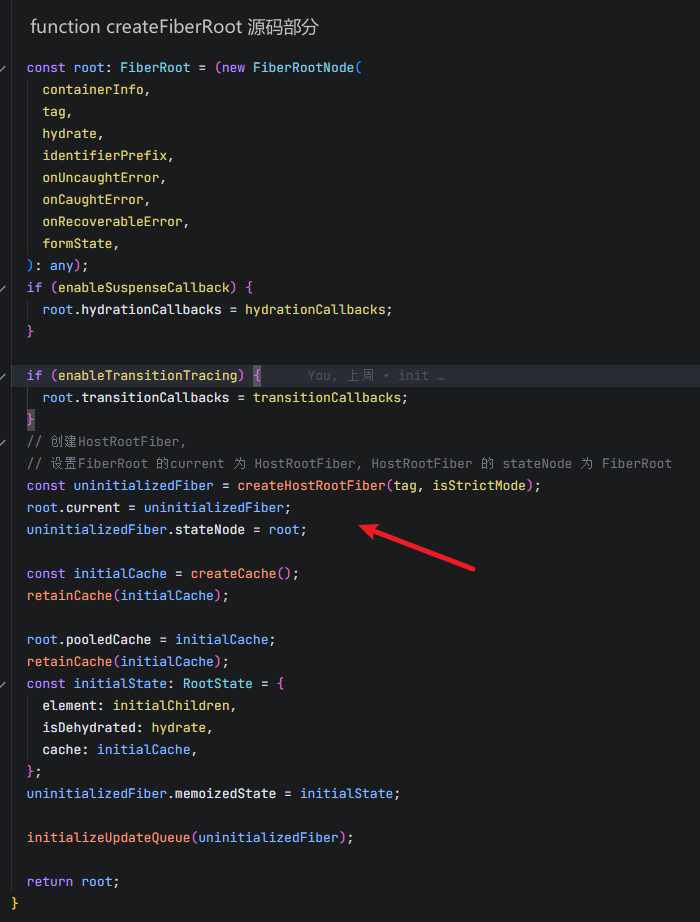

如果只盯住这张图里最关键的几行，其实就能看到这一节最重要的信息：

- 先创建 `FiberRoot`
- 再创建 `HostRoot Fiber`
- 让 `root.current = uninitializedFiber`
- 让 `uninitializedFiber.stateNode = root`
- 初始化 `memoizedState`
- 初始化 `updateQueue`

也就是说，`createRoot` 做的不是“准备一个空的 root 变量”，而是在初始化阶段就把**根级状态容器、根 Fiber 入口和更新通道**一起准备好了。

---

## 四、FiberRoot 和 HostRoot Fiber 在这里各自是什么角色

上面虽然已经提到了 FiberRoot 和 HostRoot Fiber，但这两者的角色最好单独拆开看。  
因为这会直接关系到后面第 4 篇里“Fiber 到底是什么”的理解。

### 1. FiberRoot：树外的根级状态容器

FiberRoot 可以先理解成：

> **React 在根级维护整棵树运行状态的地方。**

它不属于 Fiber 树里的某个普通节点，而是在树外侧，集中保存根级信息。

比如后面常见的这些信息，都会和它有关：

- 宿主容器 container
- 当前树入口 `current`
- pending lanes
- 其他根级状态和调度信息

所以它更像是在回答：

> “这棵树作为一个整体，目前处在什么状态？”

### 2. HostRoot Fiber：Fiber 树最顶层的根 Fiber

HostRoot Fiber 则不一样。  
它已经属于 Fiber 树内部了，而且是最顶层的那个根 Fiber。

后面真正进入 render 阶段时，工作会从这里开始往下展开。  
所以它更像是在回答：

> “如果要开始处理这棵树，入口 Fiber 在哪里？”

### 3. 两者的关系

这两层对象不是彼此独立的，而是双向连起来的。

大致可以粗略理解成：

- `FiberRoot.current -> HostRoot Fiber`
- `HostRoot Fiber.stateNode -> FiberRoot`

也就是说：

- FiberRoot 通过 `current` 指向当前这棵树的根 Fiber
- HostRoot Fiber 再通过 `stateNode` 回指到 FiberRoot

这两个引用关系非常关键。  
因为它把：

- 根级状态容器
- Fiber 树入口

真正接成了一套系统。

如果先把这里压成一句话，那就是：

> **FiberRoot 管的是“根级状态”，HostRoot Fiber 管的是“根 Fiber 入口”，两者通过双向引用连在一起。**

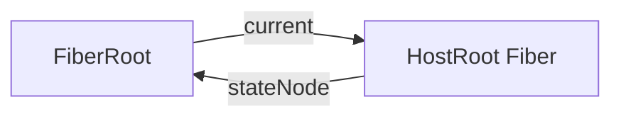

---

## 五、`root.render(element)` 到底做了什么

到这里，根容器已经搭起来了。  
接下来的问题就自然变成：

> `root.render(element)` 到底做了什么？

平时写代码时，我们很容易把它理解成：

> “开始渲染”

但如果顺着源码往下看，这里的事情其实更准确一些。

### 1. `render(children)` 接收的是已经求值好的输入

这里传进去的 `children`，在典型场景下，就是上一篇讲过的 ReactElement。

也就是说：

```jsx
root.render(<App />)
```

这行代码在真正进入 `render(...)` 方法之前，`<App />` 这段 JSX 已经先求值成了 ReactElement。  
所以 `render(...)` 本身并不负责做 JSX 到 element 的转换。

### 2. `root.render` 更像在提交一份新的 UI 描述

这一层最容易产生误解的地方就在于 `render` 这个名字。

从业务侧看，它当然对应“我要渲染这棵树”。  
但从源码这一步真正做的事情来说，它更像是在：

> **把一份新的 UI 描述提交给根级更新系统。**

也就是说，这一步还不是“立刻去改 DOM”，而是先把 element 往根级更新流程里送。

### 3. 后面会进入 `updateContainer(...)`

继续往下看，`root.render(element)` 会进入 `updateContainer(...)`。  
从这里开始，这次根更新才真正被组织起来。

所以如果把这一节压成一句话，我会更愿意这样理解：

> **`root.render` 更像是在提交一份新的 UI 描述，而不是立刻把 DOM 改掉。**

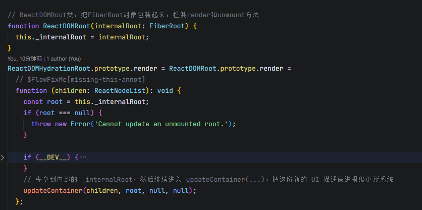

这张图里最关键的两行，就是：

- `const root = this._internalRoot`
- `updateContainer(children, root, null, null)`

也就是说，`root.render(children)` 这一层做的核心事情，就是**先拿到内部的 `_internalRoot`，然后继续进入 `updateContainer(...)`，把这份新的 UI 描述送进根级更新系统。**

---

## 六、ReactElement 是怎么变成一次 update 的

这一节是第三篇真正最值钱的部分。

因为到这里，主线第一次真正从“输入对象”推进到了“标准化更新”。

如果顺着源码往下看，大致会经过这样一条小链路：

### 1. `updateContainer(...)`

`root.render(element)` 继续往下后，会进入 `updateContainer(...)`。

这一层做的事情，先粗略理解成两步就够了：

- 找到当前根 Fiber
- 为这次更新分配 lane

也就是说，从这里开始，这份新的 element 已经不再只是“一个输入对象”，而是开始被组织成一次真正的根更新。

### 2. `createUpdate(lane)`

接着会调用 `createUpdate(lane)`，创建出一个 Update 对象。

这里的关键不是把 Update 结构细节讲完，而是先知道：

> **React 不会直接拿着 element 裸奔往下传，而是会先把它包装成一次标准化更新。**

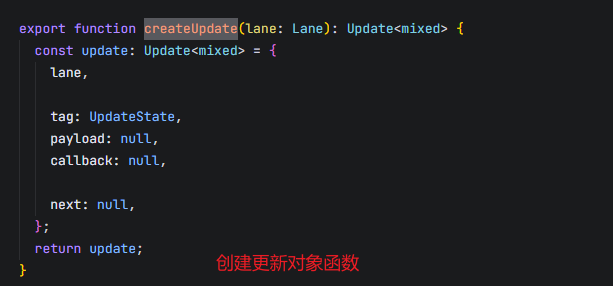

这一小步单独拿出来看会更清楚。  
`createUpdate(lane)` 做的事情并不复杂：它创建并返回一个 update 对象，先把 `lane`、`tag`、`payload`、`callback`、`next` 这些基础字段准备好。

这里最值得注意的是：**刚创建出来时，`payload` 还是 `null`。**  
也就是说，这一步只是先把“更新对象的壳”准备好。

### 3. `update.payload = { element }`

接下来，React 会把这次新的 UI 描述真正放进 update 里。

这一行是整篇第三篇里最值得盯住的一步。

因为到这里可以非常明确地看到：

> **ReactElement 被放进了这次 update 的 payload 里。**

也就是说，这一步里发生的不是：

- element 直接变成 Fiber
- element 直接变成 DOM
- element 直接进入 work loop

而是：

> **element 先被放进了一次更新对象的 payload 里。**

### 4. `enqueueUpdate(...)`

再往后，这次 update 会被挂进 HostRoot Fiber 的 update queue。

这说明根更新不会在这里立刻“一路跑到底”，而是先进入统一的更新队列。

### 5. `scheduleUpdateOnFiber(...)`

最后，这次更新会继续推进到 `scheduleUpdateOnFiber(...)`。  
从这里开始，调度入口才真正接上。

这一步我先不往后深讲，因为那已经开始进入后面几篇的空间了。  
在第三篇这里，看到这里就够了。

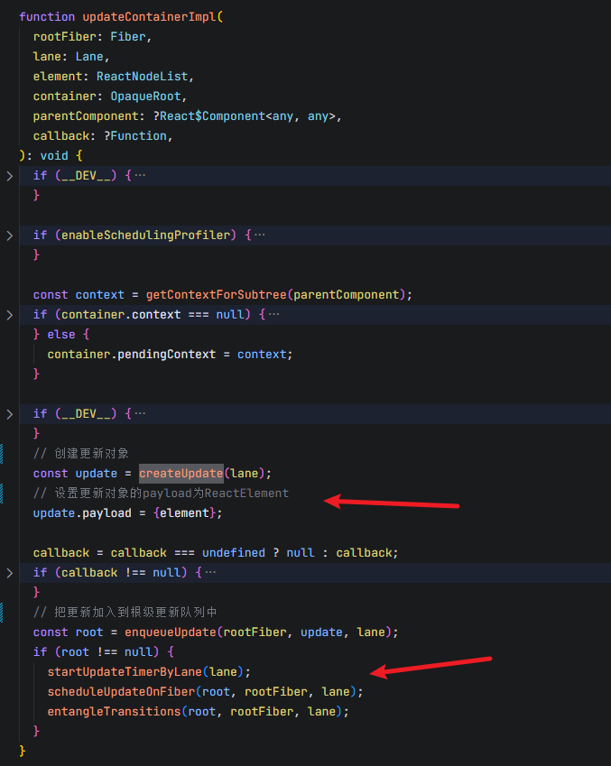

如果只看这张图里最关键的几步，主线其实非常清楚：

- 先 `createUpdate(lane)` 创建更新对象
- 再把 `update.payload = { element }`
- 然后通过 `enqueueUpdate(...)` 挂进队列
- 最后继续推进到 `scheduleUpdateOnFiber(...)`

所以第三篇真正最值得带走的一句认知就是：

> **ReactElement 在这里先变成的是一次 Update，而不是直接变成 Fiber。**

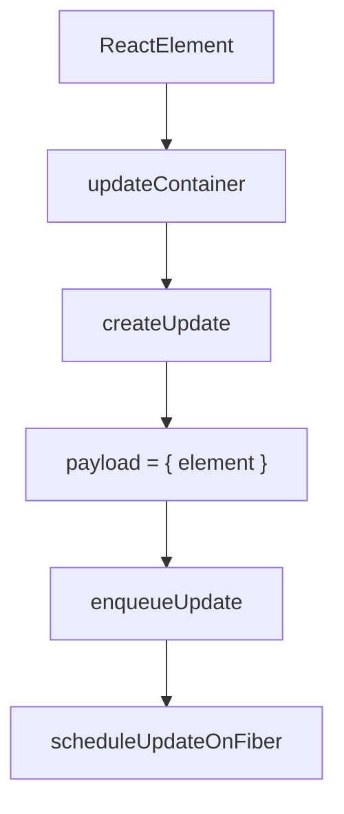

---

## 七、HostRoot Fiber 的 `updateQueue` 在这里是干什么的

看到这里时，一个很自然的问题就是：

> 为什么不是直接把 element 丢给某个 render 函数，而是非要先过 update queue？

这里的关键在于：

### 1. `updateQueue` 是挂在 Fiber 上的

更具体一点说，这里的 queue 是挂在 **HostRoot Fiber** 上的。

也就是说，根更新不是单独漂在外面的，它是和 Fiber 树入口直接关联起来的。

### 2. 根初始化时就已经把 queue 准备好了

前面第三节已经提过，根初始化时，HostRoot Fiber 的 updateQueue 就已经准备好了。

这也说明一个很重要的点：

> **React 在 root 初始化时，就已经把“后续如何接收更新”这条通道一起搭好了。**

所以 `root.render(element)` 并不是临时找地方塞进去，而是沿着一条一开始就准备好的根级更新通道进入系统。

### 3. `root.render(element)` 本质上是在提交一次根更新

从这个角度回头再看，就会更清楚：

- `root.render(element)` 不是“立刻渲染”
- 它本质上是在往 HostRoot Fiber 的 queue 上挂一次新的根更新

后面到了 render 阶段，再去真正消费它。

所以这一节想说明的，其实就一句话：

> **先经过 updateQueue，不是绕路，而是 React 把更新纳入统一运行时系统的方式。**

下面这张结构图，可以把这一层关系再看得更直观一点：

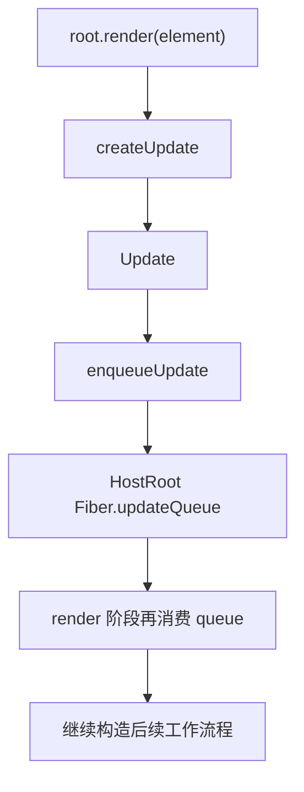

如果换成更口语一点的话，就是：

- `root.render(element)` 先创建一次 Update
- 这次 Update 不会直接变成 DOM 更新
- 它会先被放进 HostRoot Fiber 的 `updateQueue`
- 后面 render 阶段再从 queue 里把它取出来继续处理

这样理解以后，`updateQueue` 的存在就不再像一层多余中转，而更像 React 统一接收更新的标准入口。

---

## 八、到这里，React 主线走到了哪里

到这里，第三篇其实已经把 React 主线从“输入对象”推进到了“系统入口”。

如果把当前这段主线压成一条链，大致就是：

**JSX → ReactElement → createRoot 初始化根容器 → root.render(element) → createUpdate → enqueueUpdate → scheduleUpdateOnFiber**

也就是说，到这里为止：

- JSX 已经先变成 ReactElement
- Root 入口已经初始化好了
- ReactElement 已经进入根级更新系统
- 更新已经被包装成了标准化 Update，并且挂进了 HostRoot Fiber 的 queue

但还有一件事必须在这里立住：

> **到这里，ReactElement 已经进入根级更新系统了，但它还没有真正展开成 Fiber 子树。**

这句话非常重要。  
因为它直接决定了这一篇的边界。

顺着这条链再往后追，问题就会自然切到下一层：

> **这套系统里真正工作的 Fiber 到底是什么，React 为什么需要 Fiber？**

这里把主线再收束成一张更紧凑的图：

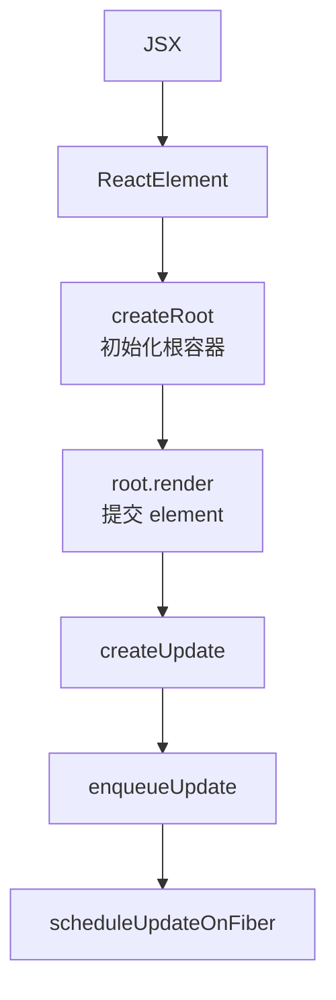

---

## 结语

React 源码最难的地方，从来都不是某一个函数本身。

真正难的是：如果没有地图，很多细节都会看起来彼此割裂。今天看到 ReactElement，明天看到 Root，后天又看到 Fiber，名词越来越多，但主线反而越来越模糊。

所以这一篇真正补上的，不是某个零散知识点，而是 React 主线里的“系统入口”这一段：

> **React 拿到 ReactElement 之后，并不是立刻把它展开成 Fiber 子树，而是先把它送进根级更新系统。**

把这一步看清楚之后，后面再去看 Fiber、Update、Queue、Lane、render、commit，这些东西的落点就会稳很多。

如果这篇对你有帮助，欢迎点个赞支持。后面我也会继续把这组 React 源码文章慢慢补完整。

这组源码解读文章也会同步整理到 GitHub 仓库里，方便集中查看和持续更新：

GitHub：https://github.com/HWYD/source-reading-notes

如果觉得这组内容对你有帮助，也欢迎顺手点个 Star。

## 最近在做的一个 AI 项目

最近我也在持续迭代一个 AI 项目：**AI Mind**。  
如果你对 AI 应用工程化方向感兴趣，欢迎来看看：

GitHub：https://github.com/HWYD/ai-mind

如果觉得还不错，也欢迎顺手点个 Star。
