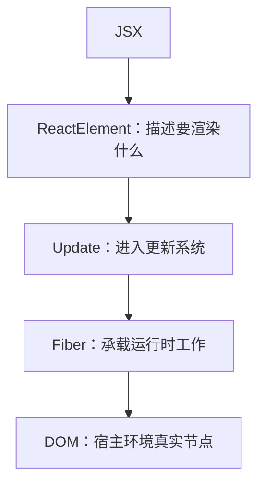
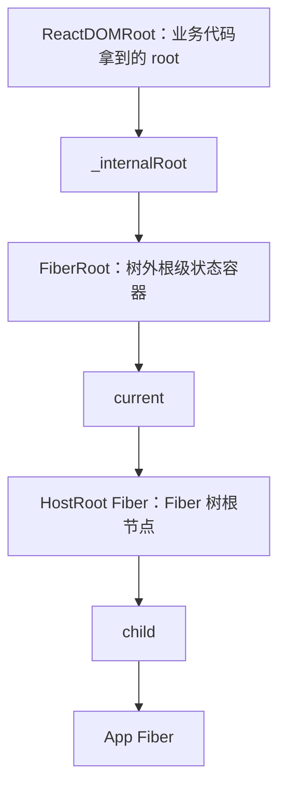
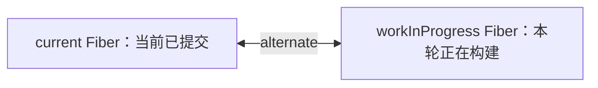
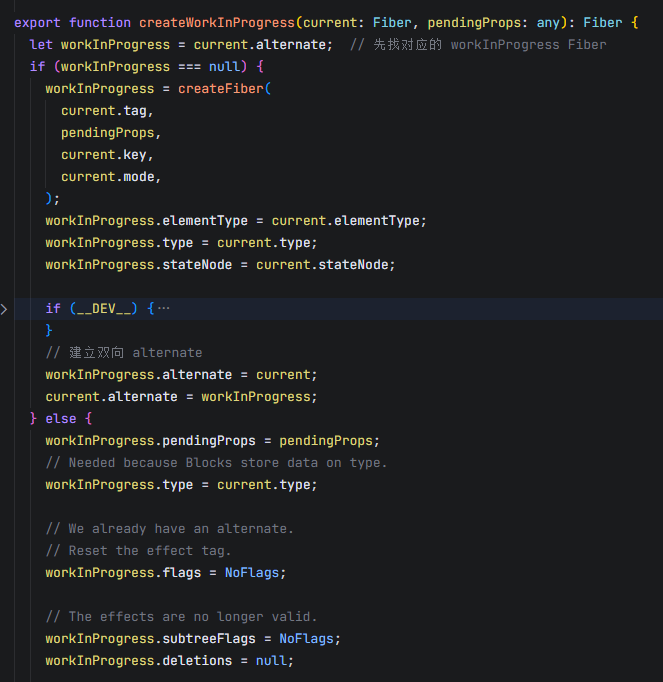
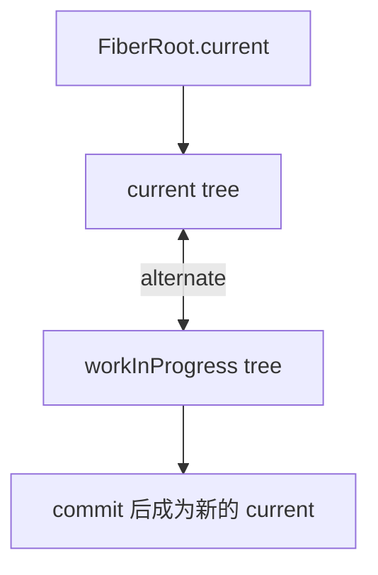
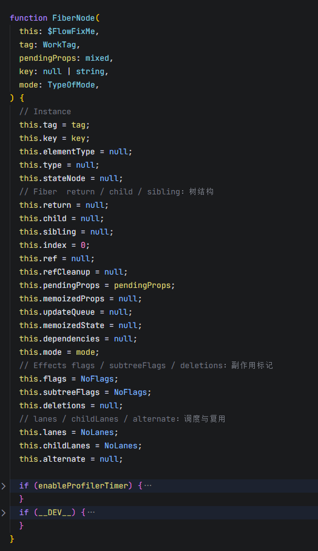
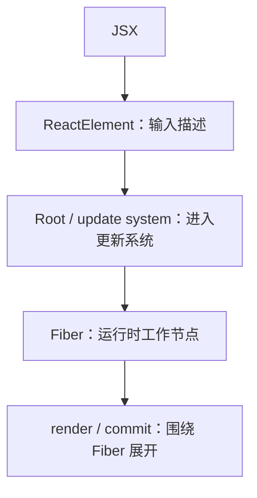

# React 19 源码主线拆解 04：Fiber 到底是什么，React 为什么需要 Fiber？

这是我持续更新的一组 React 源码解读文章，也会尽量控制单篇篇幅，按主线一点点往里拆。  
这一篇先不急着进入 `beginWork`、`completeWork` 和完整 render 流程，而是先把 React 运行时里最关键的工作节点：**Fiber**，单独理清楚。

## 前言

上一篇里，我们已经把 React 主线从 ReactElement 推进到了根级更新系统。

简单回顾一下：

- `createRoot(container)` 初始化了 Root 系统
- `root.render(element)` 把 ReactElement 送进了根级更新流程
- ReactElement 会被包装成一次 Update
- 这次 Update 会挂到 HostRoot Fiber 的 `updateQueue` 上

也就是说，主线已经走到了这里：

**ReactElement → Update → HostRoot Fiber.updateQueue**

到这一步，Fiber 这个词已经绕不开了。

因为继续往后看，很快就会遇到这些问题：

- HostRoot Fiber 到底是什么？
- FiberRoot 和 Fiber 是一个东西吗？
- Update 为什么要挂到 Fiber 的 `updateQueue` 上？
- 后面的 render 阶段，为什么不是直接处理 ReactElement，而是围绕 Fiber 展开？
- commit 阶段为什么又要看 Fiber 上的 flags？

这些问题继续往下追，都会回到一个更基础的问题上：

> **Fiber 到底是什么？React 为什么需要 Fiber？**

所以这一篇不急着进入 `beginWork`，也不急着讲完整的 render work loop，而是先把 Fiber 这个运行时工作节点本身讲清楚。

这篇文章主要想回答几个问题：

- Fiber 到底是什么，为什么不能把它理解成 ReactElement
- React 为什么需要 Fiber 这样的运行时工作节点
- FiberRoot、HostRoot Fiber、FiberNode、Fiber 树分别是什么关系
- Fiber 树是怎么通过 `child / sibling / return` 组织起来的
- `alternate` 和双缓存树到底解决了什么问题

这里也先说明一下版本口径：这篇文章标题写的是 React 19，因为整体讨论的是 React 19 的主线机制；但在具体源码观察上，我会先以 React 19.1.1 作为基线来展开。

---

## 一、先说结论：Fiber 是 React 的运行时工作节点

先把这一篇最核心的结论放在前面：

> **ReactElement 描述“我要渲染什么”，Fiber 承载“React 怎么处理这次工作”。**

这句话是理解 Fiber 的第一层边界。

第二篇里，我们已经讲过 ReactElement。它是 JSX 编译并运行之后产出的描述对象，大致描述了：

- 这是什么节点
- 节点的 `type` 是什么
- 节点上有什么 `props`
- 有没有 `key`
- 有没有 `ref`

但 ReactElement 本身很轻。  
它只是描述“我要渲染什么”，并不负责记录后续工作过程。

它不会保存：

- 当前节点的状态
- 当前节点的 `updateQueue`
- 当前节点有没有副作用
- 当前节点的调度优先级
- 当前节点和旧节点之间的复用关系

这些运行时信息，真正会落到 Fiber 上。

所以如果把 React 主线从输入到落地简单画一下，大概是这样：



这张图里最重要的不是箭头本身，而是分层：

- **ReactElement** 是输入描述
- **Fiber** 是运行时工作结构
- **DOM** 是最终落到宿主环境里的真实节点

所以这一篇最先要立住的边界就是：

> **Fiber 不是 ReactElement 的别名，而是 React 运行时用来组织更新、保存状态、标记副作用、支持调度和复用的工作节点。**

后面再看 `updateQueue`、`lanes`、`flags`、`alternate`，这些东西才不会变成一堆散乱字段。

---

## 二、为什么 React 需要 Fiber

理解 Fiber，最好先从它解决的问题开始。  
如果只盯着字段看，很容易把 Fiber 理解成一个很大的对象。

但 Fiber 真正重要的地方，不是“字段很多”，而是它改变了 React 组织更新工作的方式。

在旧式同步递归模型里，一次更新更像是：

```text
从根节点开始
一路递归往下处理
直到整棵树处理完
```

这种方式的问题是：一旦开始处理一棵大树，就容易一口气跑到底。

如果组件树很大，中间又有很多节点需要计算，就可能长时间占用主线程。  
而主线程一旦被长时间占用，页面响应、用户输入、动画这些事情都会受到影响。

更关键的是，纯同步递归模型不容易回答这些问题：

- 工作做到哪里了？
- 能不能先暂停一下？
- 能不能稍后继续？
- 能不能让更高优先级的更新先处理？
- 能不能复用上一次已经创建过的节点信息？

React 需要的不只是“递归渲染一棵树”，而是要把一次更新拆成一批更容易管理的工作单元。

Fiber 就是在这个背景下出现的。

一个 Fiber 可以理解成一个节点级工作单元。  
它不仅知道自己代表什么节点，还能记录：

- 自己在树里的位置
- 本轮待处理的 props
- 上一次保存下来的状态
- 当前节点上有没有更新
- 当前节点或子树有没有副作用
- 当前节点和旧节点之间怎么复用
- 当前节点上有哪些优先级的工作

所以 Fiber 最大的意义，不是把树换一种写法，而是：

> **让 React 不只是递归渲染一棵树，而是能管理一批可记录、可复用、可调度的工作单元。**

Scheduler、时间切片、Concurrent Rendering 的完整细节可以先放一放。  
这一篇先抓住一点就够了：

> **Fiber 是 React 后续更新、render、commit 能够围绕一套工作节点推进的基础。**

---

## 三、Fiber、FiberNode、Fiber 树、FiberRoot、HostRoot Fiber 是什么关系

Fiber 这个词很容易让人混，因为它在不同上下文里会指向不同层次的东西。

比如我们会看到：

- Fiber
- FiberNode
- Fiber 树
- FiberRoot
- HostRoot Fiber
- ReactDOMRoot

这些词如果不先拆开，后面源码会越看越乱。

这一节先把它们的关系讲清楚。

### 1. FiberNode：单个工作节点

从源码结构上看，具体的数据结构通常是 FiberNode。

我们平时说“一个 Fiber”，很多时候指的就是一个 FiberNode。

它可以对应不同类型的 React 节点，比如：

- 函数组件
- 类组件
- 原生 DOM 标签
- Fragment
- Suspense

这里不用把所有 `tag` 类型都列出来。  
先把它粗略理解成一句话：

> **一个 FiberNode，就是 React 运行时里的一个节点级工作单元。**

### 2. Fiber 树：由 FiberNode 连接成的工作树

单个 FiberNode 不是孤立存在的。  
很多 FiberNode 会通过指针连接起来，形成一棵 Fiber 树。

这棵树不是 DOM 树，也不是 ReactElement 树。  
它是 React 运行时真正用来推进工作的树。

后面的 render 阶段，React 会围绕 Fiber 树进行计算。  
commit 阶段，也会根据 Fiber 上记录的副作用标记去执行真实更新。

### 3. HostRoot Fiber：Fiber 树最顶层的根 Fiber

第三篇里，我们已经见过 HostRoot Fiber。

它是 Fiber 树内部最顶层的根 Fiber。

注意这里的关键词是：**Fiber 树内部**。

HostRoot Fiber 本身是一个 FiberNode，只不过它处在整棵 Fiber 树的最顶层。  
根级 `updateQueue` 也会挂在这个 HostRoot Fiber 上。

所以第三篇里看到：

```text
HostRoot Fiber.updateQueue
```

其实就是在说：

> 根更新先挂到 Fiber 树最顶层的那个 Fiber 上。

### 4. FiberRoot：树外侧的根级状态容器

FiberRoot 和 HostRoot Fiber 不是一个东西。

FiberRoot 更像是整棵树外侧的根级状态容器。  
它保存根级别的信息，比如：

- 宿主容器 container
- 当前 Fiber 树入口
- pending lanes
- 根级调度状态

FiberRoot 会通过 `current` 指向当前 Fiber 树的 HostRoot Fiber：

```text
FiberRoot.current -> HostRoot Fiber
```

也就是说：

- FiberRoot 在树外，管理整棵树的根级状态
- HostRoot Fiber 在树内，是 Fiber 树的根节点

这个边界非常重要。

### 5. ReactDOMRoot：对外暴露的 root 句柄

业务代码里写的是：

```js
const root = createRoot(container)
```

这里拿到的 `root`，不是 FiberRoot，也不是 HostRoot Fiber，而是 ReactDOMRoot。

ReactDOMRoot 是 React DOM 暴露给业务代码使用的 root 句柄。  
它内部再通过 `_internalRoot` 持有真正的 FiberRoot。

把这几层合起来，大概是这样：



所以这一节最重要的结论是：

> **FiberRoot 是树外的根级状态容器，HostRoot Fiber 才是 Fiber 树内部的根节点。**

只要这个边界分清楚，后面再看到 `root.current`、`root.stateNode`、HostRoot Fiber，就不会混成一团。

---

## 四、ReactElement 和 Fiber 到底有什么区别

第二篇里，我们已经讲过 ReactElement。  
这一篇从 Fiber 的角度，再把两者边界补完整。

很多人第一次看源码时，会把这条链想得过于简单：

```text
JSX → ReactElement → Fiber
```

好像 ReactElement 只是换个名字就变成了 Fiber。

但实际上，ReactElement 和 Fiber 是两层完全不同的东西。

### 1. ReactElement：描述“我要渲染什么”

ReactElement 是输入描述对象。

它主要描述：

- `type`
- `key`
- `ref`
- `props`

它的任务是表达：

> “我要渲染一个什么东西？”

比如：

```jsx
<App count={1} />
```

最终会变成一个 ReactElement。  
这个 ReactElement 描述了：这里要渲染一个 `App`，并且带着 `count: 1` 这样的 props。

但 ReactElement 本身不负责保存运行时工作信息。

它没有：

- `updateQueue`
- `lanes`
- `flags`
- `subtreeFlags`
- `alternate`
- `memoizedState`

所以它不是后续 render / commit 真正围绕处理的工作节点。

### 2. Fiber：承载“React 怎么处理这次工作”

Fiber 则不一样。

Fiber 要回答的问题不是“我要渲染什么”，而是：

> “这次更新里，这个节点要怎么被处理？”

所以 Fiber 上会保存更多运行时信息，比如：

- 当前节点在 Fiber 树里的位置
- 当前节点上一次保存下来的 props / state
- 当前节点本轮待处理的新 props
- 当前节点上有没有 updateQueue
- 当前节点或子树有没有副作用标记
- 当前节点有哪些 lanes
- 当前节点和另一棵树里的对应 Fiber 是什么关系

如果用表格对比，会更清楚：

| 对比项 | ReactElement | Fiber |
|---|---|---|
| 定位 | 输入描述对象 | 运行时工作节点 |
| 来源 | JSX 编译后运行时创建 | render 过程中创建或复用 |
| 是否保存状态 | 不保存 | 保存 `memoizedState` |
| 是否有更新队列 | 没有 | 可以有 `updateQueue` |
| 是否记录副作用 | 不记录 | 通过 `flags` 等字段记录 |
| 是否参与调度 | 不直接参与 | 通过 `lanes / childLanes` 参与 |
| 是否关联旧节点 | 不关联 | 通过 `alternate` 关联 |

所以这一节最核心的一句话是：

> **ReactElement 是输入描述，Fiber 是运行时工作结构。**

这一篇先把两者边界立住。  
后面再进入 render 阶段时，才能更顺地理解 Fiber 子树是怎么被构建出来的。

---

## 五、`child / sibling / return` 如何组织 Fiber 树

既然 Fiber 是一棵运行时工作树，那这棵树是怎么组织起来的？

为了更直观，可以先看一个很简单的 JSX：

```jsx
function App() {
  return (
    <>
      <Header />
      <Main />
      <Footer />
    </>
  )
}
```

从 ReactElement 的角度看，这里描述的是 App 下面有三个子节点：`Header`、`Main`、`Footer`。

而到了 Fiber 这层，React 不会简单把它们理解成一个普通数组，而是会用 `child / sibling / return` 把它们串成一棵 Fiber 树。

FiberNode 里有三个非常关键的树结构字段：

- `child`
- `sibling`
- `return`

它们共同把一个个 FiberNode 连接成 Fiber 树。

### 1. `child`：第一个子 Fiber

`child` 指向当前 Fiber 的第一个子 Fiber。

比如 App 下面有 Header、Main、Footer 三个子节点。  
那么 App Fiber 的 `child` 会指向第一个子节点，也就是 Header Fiber。

### 2. `sibling`：下一个兄弟 Fiber

如果 Header 后面还有 Main，那么 Header Fiber 的 `sibling` 会指向 Main Fiber。  
Main 后面还有 Footer，那么 Main Fiber 的 `sibling` 会指向 Footer Fiber。

也就是说，同一层的兄弟节点，不是都放在一个数组里，而是通过 `sibling` 串起来。

### 3. `return`：父 Fiber

`return` 指向当前 Fiber 的父 Fiber。

这里的 `return` 不是 JavaScript 里的 `return` 语句，而是 FiberNode 上的一个字段。  
可以先把它理解成：

> “处理完当前节点后，应该回到哪里？”

用一张图看会更直观：


这里的 Header Fiber、Main Fiber、Footer Fiber 的 `return` 都会指回 App Fiber。  
这样 React 在处理完某个子节点或兄弟节点之后，就能继续回到父节点，接着推进后续工作。

所以这一节可以先收成一句话：

> **child / sibling / return 让 Fiber 树可以用链表式结构表示，也为后面的 work loop 遍历打下基础。**

这里先不展开 `beginWork`、`completeWork` 和完整深度优先遍历。  
那是后面讲 render 阶段时要重点看的内容。

---

## 六、`alternate` 和双缓存树：current / workInProgress 是什么

讲 Fiber，绕不开 `alternate`。

因为后面进入 render 阶段时，会不断看到这些词：

- current
- workInProgress
- alternate

如果这里不先建立基本认知，后面看 render 会非常容易乱。

### 1. current 树：当前已经提交的 Fiber 树

React 已经提交到页面上的那棵 Fiber 树，可以先理解成 current 树。

FiberRoot 的 `current` 会指向当前这棵树的 HostRoot Fiber。

也就是说，当前页面已经对应着一棵 Fiber 树，这棵树就是 current 树。

### 2. workInProgress 树：本轮更新正在构建的新树

当一次新的更新开始时，React 不会直接在 current 树上乱改。

它会基于 current 树创建或复用一棵新的工作树，也就是 workInProgress 树。

这棵树可以先理解成：

> **本轮更新正在计算中的下一版 UI 状态。**

也就是说：

- current 树代表当前页面已经确认的状态
- workInProgress 树代表本轮更新正在计算的新状态

### 3. `alternate`：连接 current Fiber 和 workInProgress Fiber

current 树和 workInProgress 树不是完全孤立的。

两个树里对应的 Fiber，会通过 `alternate` 关联起来。

可以粗略理解成：

```text
current Fiber  <── alternate ──>  workInProgress Fiber
```

用图表示就是：



有了这个关联之后，React 就能知道：

- 旧 Fiber 是谁
- 新 Fiber 是谁
- 哪些信息可以复用
- 哪些信息需要更新
- 本轮工作和上一轮工作之间是什么关系



这张图不用逐行记。这里最关键的是三件事：

- React 会先从 `current.alternate` 上尝试取得对应的 workInProgress Fiber
- 如果不存在，就创建新的 Fiber，并让 `current` 和 `workInProgress` 通过 `alternate` 双向连接
- 如果已经存在，就复用这个 workInProgress，同时重置本轮更新相关的 `flags / subtreeFlags / deletions`

所以 `alternate` 不是一个孤立字段，它正是 current 树和 workInProgress 树之间的连接点。

### 4. 为什么要有双缓存树

双缓存树可以先用一个很直观的比喻理解：

> 前台展示一棵已经稳定的树，后台准备另一棵新的树。

React 不直接在 current 树上乱改，而是先构建 workInProgress 树。  
等这棵新树处理完成，并且进入 commit 阶段后，再把它切换成新的 current 树。

也就是说：

```text
current tree
    ↓  基于它构建
workInProgress tree
    ↓  commit 后
new current tree
```

更完整一点可以这样理解：



这一节最重要的结论是：

> **alternate 把旧 Fiber 和新 Fiber 关联起来，是双缓存树、节点复用和后续可中断渲染的重要基础。**

`createWorkInProgress`、`reconcileChildren`、bailout 这些细节可以先放一放。  
这一层先把 current / workInProgress / alternate 的关系理清就够了。

---

## 七、FiberNode 的关键字段：为什么它不是普通树节点

如果只把 Fiber 看成一个树节点，就会低估它。

Fiber 不只是有 `child / sibling / return` 这些树结构字段。  
它还会把 React 后续工作需要的信息都组织在一个节点上。

先看一张 `FiberNode` 构造函数里的源码截图：



这张图不用逐行记。重点是先看到几个分组：

- `tag / key / type / stateNode`：节点身份和实例连接
- `return / child / sibling`：Fiber 树结构
- `pendingProps / memoizedProps / memoizedState`：输入和状态
- `updateQueue`：更新队列
- `flags / subtreeFlags / deletions`：副作用标记
- `lanes / childLanes`：调度相关信息
- `alternate`：连接另一棵树里的对应 Fiber

如果把这些字段再按功能整理一下，大概是这样：

```text
FiberNode
├── 身份：tag / type / key
├── 树结构：return / child / sibling
├── 输入与状态：pendingProps / memoizedProps / memoizedState
├── 更新：updateQueue
├── 副作用标记：flags / subtreeFlags / deletions
├── 调度：lanes / childLanes
├── 复用：alternate
└── 宿主连接：stateNode
```

这里不需要逐个背字段，更适合按功能看它们分别解决什么问题。

### 1. 身份信息：`tag / type / key`

这一组字段回答的是：

> 这个 Fiber 代表什么类型的节点？

比如：

- `tag` 表示 Fiber 类型
- `type` 表示具体组件函数、类、原生标签等
- `key` 用于同层节点比较和复用

这决定了 React 后面应该用什么方式处理这个 Fiber。

### 2. 树结构：`return / child / sibling`

这一组字段回答的是：

> 这个 Fiber 在树里的位置在哪里？

前面已经讲过：

- `child` 指向第一个子 Fiber
- `sibling` 指向下一个兄弟 Fiber
- `return` 指向父 Fiber

它们让 Fiber 能够连成一棵可遍历的工作树。

### 3. 输入与状态：`pendingProps / memoizedProps / memoizedState`

这一组字段回答的是：

> 当前节点的新输入是什么，已经保存下来的状态是什么？

大致可以先这样理解：

- `pendingProps`：本轮待处理的新 props
- `memoizedProps`：上一次已经确认下来的 props
- `memoizedState`：当前 Fiber 上保存的状态

这里可以先记住一点：Fiber 不只是描述节点，它还保存运行时状态。

函数组件 Hooks 的状态，后面也会和 `memoizedState` 这条线有关。  
但这里先不展开 Hook 链表，后面讲 Hooks 内部实现时再继续看。

### 4. 更新：`updateQueue`

这一组字段回答的是：

> 这个节点上有没有等待处理的更新？

第三篇里，我们已经看到 HostRoot Fiber 上有 `updateQueue`。  
`root.render(element)` 触发的根更新，就会挂到 HostRoot Fiber 的 `updateQueue` 上。

到了更一般的组件更新里，Fiber 也会成为更新队列挂载和后续消费的工作节点。

这里先不展开 updateQueue 内部结构。  
下一篇进入“一次更新怎么进入系统”时，会继续看 Update、Queue、Lane 和 Schedule。

### 5. 副作用标记：`flags / subtreeFlags / deletions`

这一组字段回答的是：

> 这个节点或它的子树，在 commit 阶段有没有事情要做？

比如：

- 是否需要插入 DOM
- 是否需要更新 DOM
- 是否有节点需要删除
- 子树里是否存在副作用

这三个字段可以先这样理解：

- `flags`：当前 Fiber 自身的副作用标记
- `subtreeFlags`：当前 Fiber 子树里的副作用汇总标记
- `deletions`：本轮需要删除的子 Fiber

这里有一个边界必须说清楚：

> **Fiber 上记录的是副作用标记，不是立刻执行副作用。**

真正执行 DOM 操作和 effect 的地方，是后面的 commit 阶段。  
Fiber 在这里做的是记录和标记，让 commit 阶段知道后面要做什么。

### 6. 调度：`lanes / childLanes`

这一组字段回答的是：

> 这个 Fiber 以及它的子树上，有哪些优先级的工作需要处理？

先不用急着进入位运算细节。  
可以粗略理解成：

- `lanes` 和当前 Fiber 自身的更新有关
- `childLanes` 和子树里的更新有关

它们会帮助 React 判断哪些工作需要被处理，哪些子树里还有待完成的更新。

这一部分也会在后面讲 Update 和 Lane 时继续接上。

### 7. 复用：`alternate`

`alternate` 回到前面第六节讲的双缓存树。

它回答的是：

> 这个 Fiber 和另一棵树里的对应 Fiber 是什么关系？

有了 `alternate`，React 才能在 current 树和 workInProgress 树之间建立关联，从而为复用和后续工作推进打基础。

### 8. 宿主连接：`stateNode`

`stateNode` 的含义会随着 Fiber 类型不同而不同。

比如：

- HostComponent 对应的 `stateNode` 可能是 DOM 节点
- ClassComponent 对应的 `stateNode` 可能是类组件实例
- HostRoot Fiber 的 `stateNode` 指向 FiberRoot

这里不用展开所有情况。  
先知道 `stateNode` 是 Fiber 和实际实例 / 宿主对象之间的一条连接即可。

所以这一节最后可以收成一句话：

> **Fiber 不是普通树节点，而是 React 运行时把状态、更新、副作用标记、调度优先级和复用关系组织在一起的工作节点。**

---

## 八、把 Fiber 接回 React 主线

到这里，Fiber 这层结构就基本立起来了。

如果把前几篇串起来，现在 React 主线已经可以这样理解：

```text
JSX
→ ReactElement
→ Root / update system
→ Fiber 作为运行时工作节点
```

也就是说：

- 第二篇讲清楚了 React 的输入对象是 ReactElement
- 第三篇讲清楚了 ReactElement 会先进入根级更新系统
- 这一篇则把 Fiber 这个运行时工作节点立起来了

从这里开始，React 主线就真正进入运行时工作阶段。

后面的更新、render、commit，都会继续围绕 Fiber 展开：

- 更新会挂到 Fiber 的 `updateQueue`
- render 阶段会构建 workInProgress Fiber 树
- commit 阶段会读取 Fiber 上的 flags 去执行 DOM 更新和副作用

用一张图收一下：



所以这一篇真正要建立的，不是对某个字段的记忆，而是这个判断：

> **从这里开始，React 主线真正进入运行时工作阶段。后面的更新、render、commit，都要围绕 Fiber 树继续展开。**

---

## 结语

React 源码最难的地方，从来都不是某一个字段本身。

真正难的是：如果没有主线，ReactElement、FiberRoot、HostRoot Fiber、alternate、lanes、flags 这些词会看起来彼此割裂。

所以这一篇真正想补上的，不是 Fiber 的所有实现细节，而是先把 Fiber 在 React 主线里的位置立住：

> **ReactElement 是输入描述，Fiber 是运行时工作节点。**

当这个边界立住以后，后面再看 Update、Queue、Lane、render、commit，落点就会稳定很多。

Fiber 这层结构立住以后，下一步就可以看一次真正的组件更新：`setState` / Hook dispatch 触发后，React 是怎么创建 Update、进入 Queue、分配 Lane，并最终走到调度入口的。

如果这篇对你有帮助，欢迎点个赞支持。后面我也会继续把这组 React 源码文章慢慢补完整。

这组源码解读文章也会同步整理到 GitHub 仓库里，方便集中查看和持续更新：

GitHub：https://github.com/HWYD/source-reading-notes

如果觉得这组内容对你有帮助，也欢迎顺手点个 Star。

## 最近在做的一个 AI 项目

最近我也在持续迭代一个 AI 项目：**AI Mind**。  
如果你对 AI 应用工程化方向感兴趣，欢迎来看看：

GitHub：https://github.com/HWYD/ai-mind

如果觉得还不错，也欢迎顺手点个 Star。
